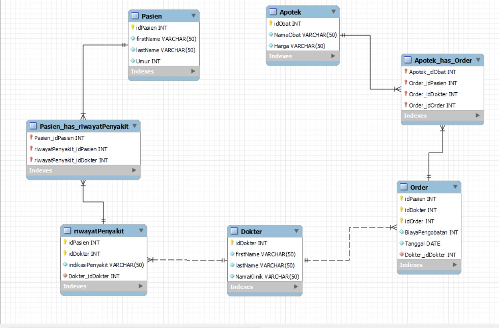

# Database Practice
## Description
Practice database management in Workbench by creating, modifying, and organizing databases, tables, and relationships efficiently. This activity also includes executing SQL queries to manage data, ensuring accuracy, and optimizing database performance.

## Preview 

     

